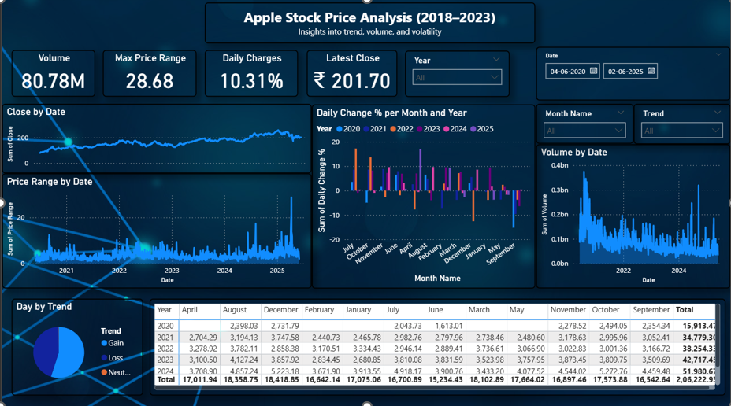
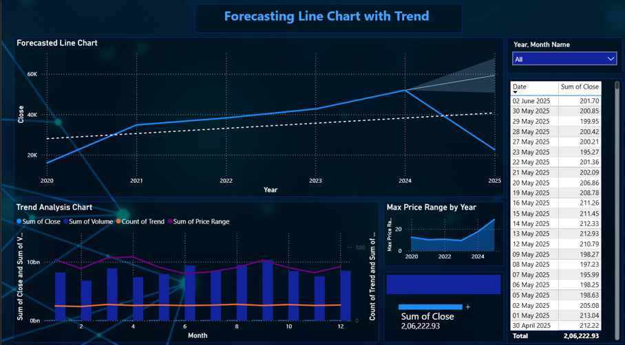

Perfect 👍 thanks for sharing repo details!
Here’s a **complete `README.md` code** tailored exactly for your **Time-series-stock-market** project with your repo structure, Jupyter Notebook, Power BI dashboard, and forecast files.

You can **copy-paste this into your repo’s README.md**:

```markdown
# 📈 Time Series Stock Market Analysis  

This repository contains my **final project submission** on **Stock Market Time Series Analysis**.  
The project uses **Python (Jupyter Notebook)** for analysis & forecasting, and **Power BI** for building an interactive dashboard.  

---

## 🚀 Project Overview
The objective of this project is to:
- Perform **time series analysis** on stock price data  
- Apply forecasting models like **ARIMA, LSTM, and Prophet**  
- Compare forecasting results from different models  
- Build a **Power BI dashboard** to visualize stock trends & insights  

---

## 🛠️ Tools & Technologies
- **Python** (Jupyter Notebook)  
  - Libraries: `pandas`, `numpy`, `matplotlib`, `seaborn`, `statsmodels`, `scikit-learn`, `fbprophet`  
- **Power BI** (interactive dashboard)  
- **CSV datasets** for storing forecasts  

---

## 📂 Repository Structure
```

├── Analysis\_proj.ipynb          # Jupyter Notebook with full analysis
├── zidio.pbix                   # Power BI dashboard file
├── arima\_forecast.csv           # ARIMA model forecast output
├── lstm\_forecast.csv            # LSTM model forecast output
├── prophet\_forecast.csv         # Prophet model forecast output
├── Project Report.pdf           # Final report with documentation
├── 1.png                        # Dashboard / analysis screenshot
├── 2.png                        # Dashboard / analysis screenshot
├── README.md                    # Project documentation

````

---

## ⚙️ Installation & Setup

1. Clone this repository:
   ```bash
   git clone https://github.com/Abhishek-Maheshwari-778/Time-series-stock-market.git
   cd Time-series-stock-market
````

2. Install required Python libraries:

   ```bash
   pip install pandas numpy matplotlib seaborn statsmodels scikit-learn fbprophet
   ```

3. Open the Jupyter Notebook:

   ```bash
   jupyter notebook Analysis_proj.ipynb
   ```

4. Open the Power BI dashboard (`zidio.pbix`) to explore interactive insights.

---

## 📊 Dashboard Preview

### Power BI Dashboard




---

## 🔍 Key Features

* Stock price **trend analysis** & **visualization**
* Forecasting using **ARIMA, LSTM, Prophet** models
* Comparison of different forecasting methods
* **Interactive dashboard** with filters (date, stock type, performance)

---

## 🎯 Insights

* Identified **patterns, seasonality, and trends** in stock prices
* Forecasted future stock performance using multiple models
* Built a **business-friendly dashboard** for decision making

---

## 📌 Future Work

* Integration with **real-time stock APIs**
* Deployment of dashboard to **Power BI Service** for live use
* Testing with more advanced **deep learning models**

---

## 📑 Project Report

Full details of methodology, results, and conclusions are documented in the [**Project Report.pdf**](Project%20Report.pdf).

---

## ✨ Author

**Abhishek Maheshwari**
📧 [abhishekmaheshwari2436@gmail.com](mailto:abhishekmaheshwari2436@gmail.com)
🌐 [LinkedIn](https://linkedin.com/in/your-profile) | [GitHub](https://github.com/Abhishek-Maheshwari-778)

---

```

⚡ Tip: Add your **actual LinkedIn link** and email above before committing.  

Want me to also include a **sample code block (like ARIMA or Prophet forecast snippet)** in the README so visitors see your approach without opening the notebook?
```
